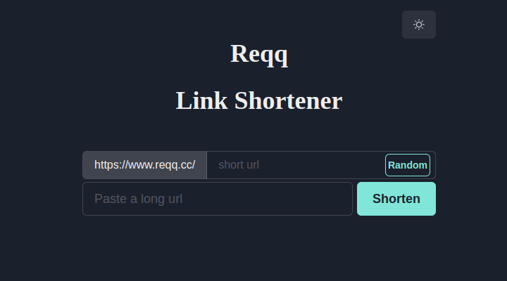
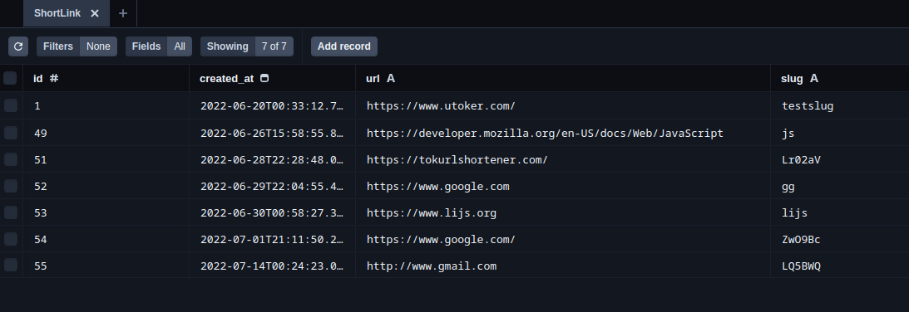

[![LinkedIn][linkedin-shield]](https://www.linkedin.com/in/utoker/)

<!-- PROJECT LOGO -->
 

  

<h3 align="center">Reqq Link Shortener</h3>
     
    <a href="https://github.com/utoker/link-shortener/tree/main/src"><strong>Explore the docs »</strong></a>
     
     
    <a href="https://www.reqq.cc/">View Website</a>

## About The Project

The reqq.cc is an easy-to-use link shortening service with an option to use custom URLs.

I did this project as a free alternative to paid services like bit.ly or tinyurl.com.

 
<ul>
    <li>Leveraged MySQL compatible PlanetScale database via Prisma to effectively manage data.</li>
    <li>Developed and integrated a type-safe API by implementing tRPC in a TypeScript environment.</li>
    <li>Integrated Next Redirect to enable the redirection of incoming requests.</li>
    <li>Performed research to gather project requirements and identify needs.</li>
</ul>

Data query from PlanetScale with Prisma.

 
 
<!--  -->

<!-- [![Product Name Screen Shot][product-screenshot]](https://example.com)-->

(<a href="#top">back to top</a>)

<!-- GETTING STARTED -->

## Usage

Simple use the text input bar to enter the URL you want to shorten.

(<a href="#top">back to top</a>)

### Built With

- [React.js](https://reactjs.org/)
- [Next.js](http://nextjs.org/)
- [TypeScript](https://www.typescriptlang.org/)
- [Prisma](https://www.prisma.io/)
- [tRPC](https://tRPC.io/)
- [PlanetScale](https://www.planetscale.com/)
- [nanoid](https://www.npmjs.com/package/nanoid)

(<a href="#top">back to top</a>)

## Contact

Umut Toker - utoker@gmail.com

LinkedIn: [https://www.linkedin.com/in/utoker/](https://www.linkedin.com/in/utoker/)

Project Link: [https://github.com/utoker/link-shortener](https://github.com/utoker/link-shortener)

(<a href="#top">back to top</a>)

<!-- MARKDOWN LINKS & IMAGES -->
<!-- https://www.markdownguide.org/basic-syntax/#reference-style-links -->

[linkedin-shield]: https://img.shields.io/badge/-LinkedIn-black.svg?style=for-the-badge&logo=linkedin&colorB=555
[linkedin-url]: https://linkedin.com/in/linkedin_username
[product-screenshot]: src/public/card.png
